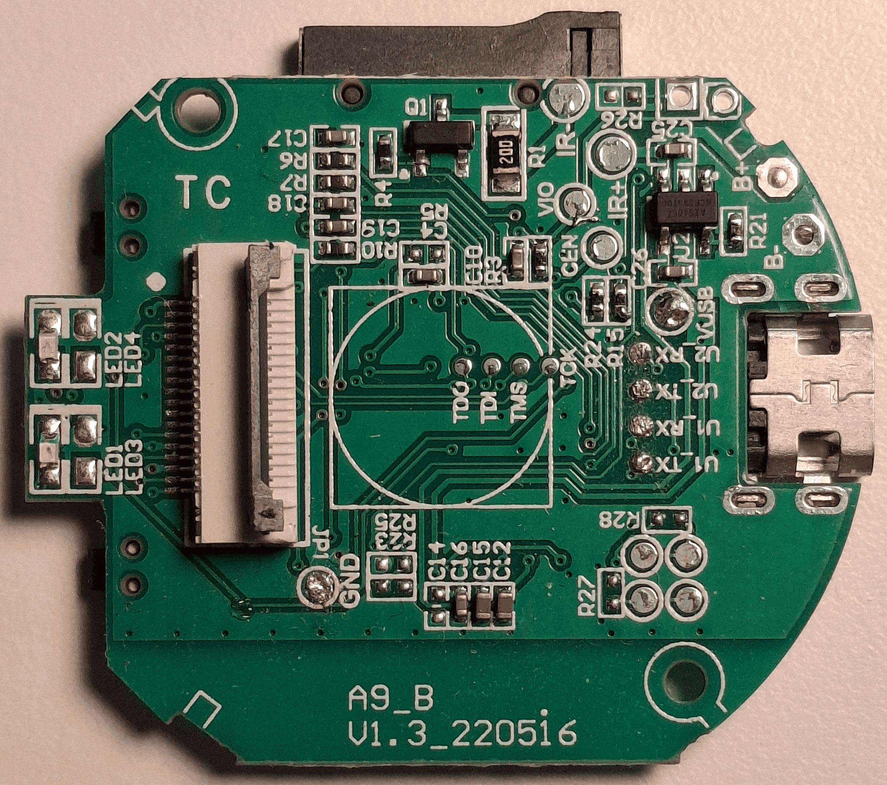
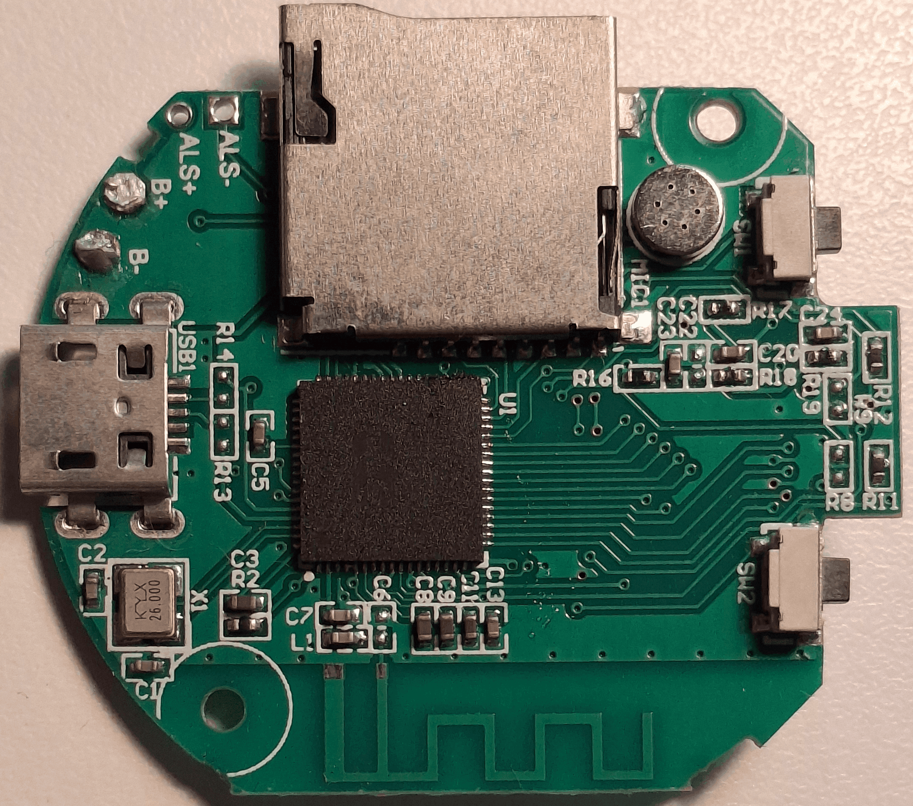

### Pins visible on the front and back plate

On the front plate, there are multiple pins (also some things on the back).

  
  

---

Front Plate:
- U1_TX
- U1_RX
- U2_TX
- U2_RX

- VUSB
- GND : ground

- IR-
- IR+
 
- B+ : Battery possitive terminal (3.3V)
- B- : Battery possitive terminal (3.3V)
 
- VIO
- CEN

- Under the camera module:
  - TDO
  - TDI
  - TMS
  - TOK

- 4 unnamed pins between R27 and R28 resistors

---

Back Plate:
- B+ : Battery possitive terminal (3.3V)
- B- : Battery possitive terminal (3.3V)

- ALS+ : (through-hole) 
- ALS- : (through-hole)
